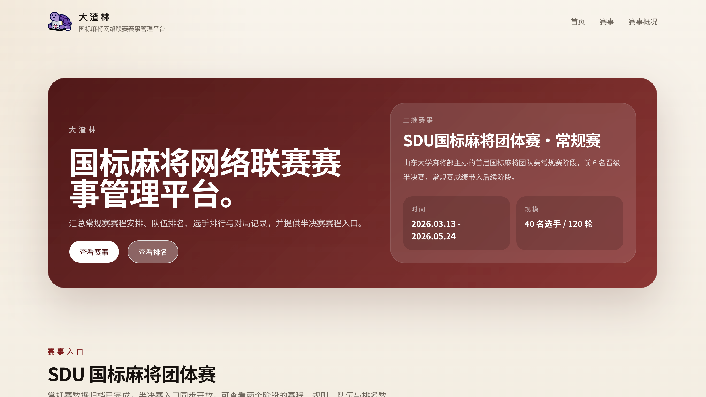
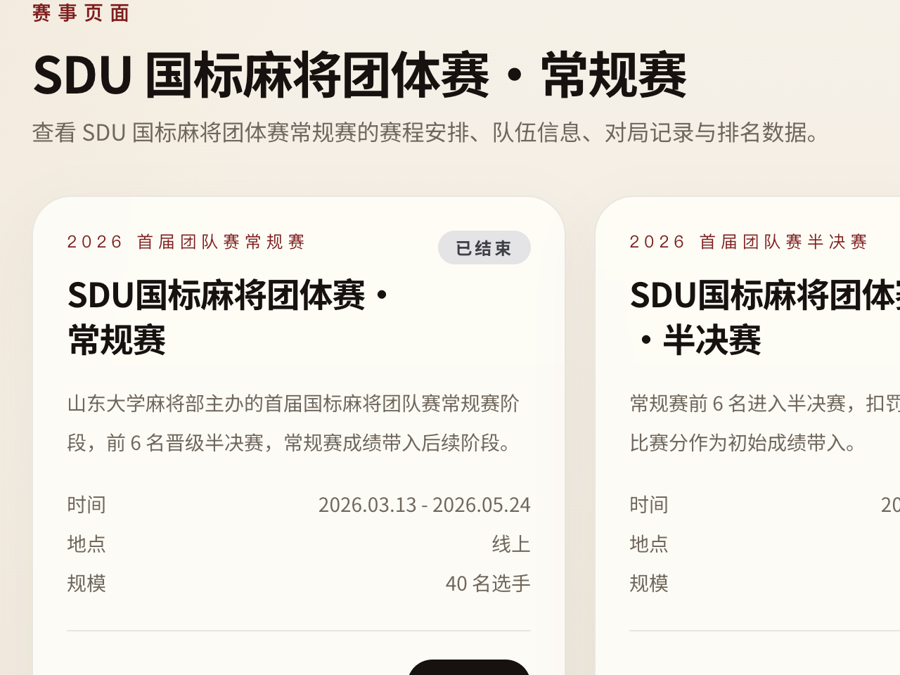
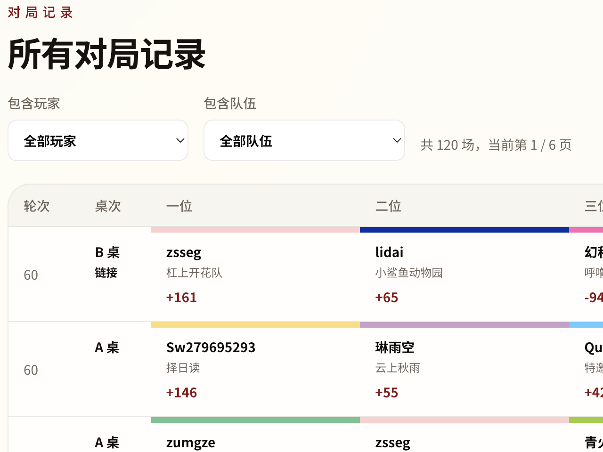
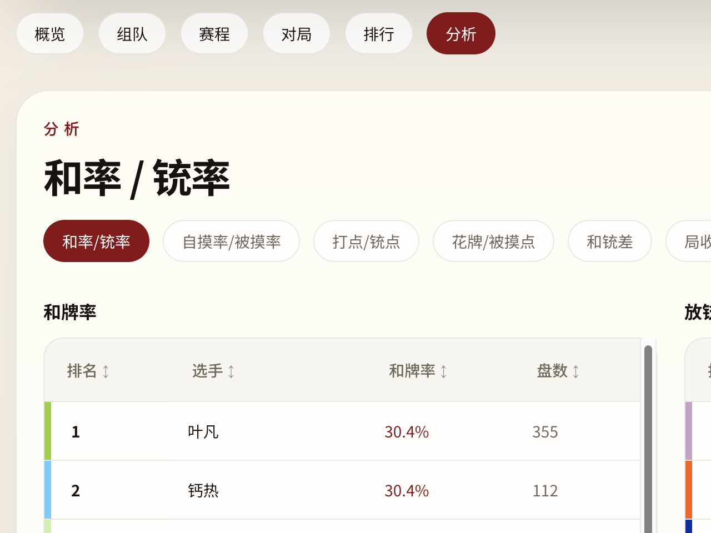
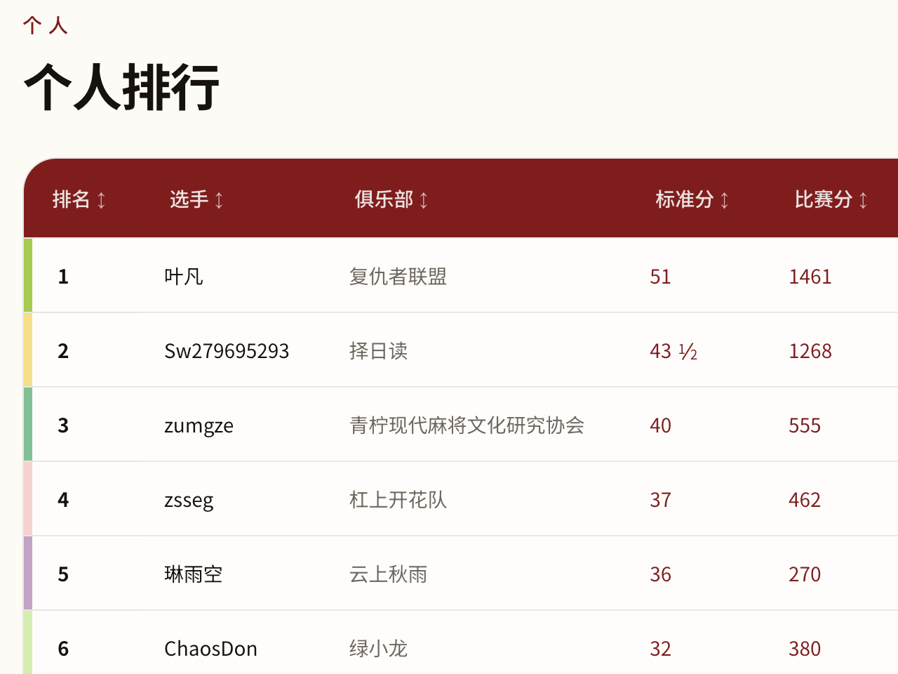

# 大渣林 — 国标麻将网络联赛赛事管理平台

在线访问：https://web.choimoe.com/sduleague/

## 简介

大渣林是一个基于 Next.js 构建的静态赛事管理平台，用于展示和分析雀渣平台上的国标麻将网络联赛数据。目前主要服务于 **SDU国标麻将团体赛**。



## 功能

赛事首页、赛程表、队伍名册、个人与团队排名、对局记录，以及涵盖和率、铳率、自摸率、打点、铳点、局收支、凑番榜、大牌榜、收藏家等维度的统计分析。

|赛事：可以动态添加多种赛事|对局：筛选制定玩家全部记录|
|:---:|:---:|
|||

|分析：支持多种牌谱分析数据|排名：通过牌谱计分自动更新|
|:---:|:---:|
|||


## 快速开始

### 前置要求

- Node.js
- npm

### 安装与运行

```bash
# 安装依赖
npm install
npm run dev
# 访问 http://localhost:3000/sduleague/
```

### 构建

```bash
npm run build
```

## 当前赛事

| 赛事 | 状态 | 时间 | 队伍 | 选手 |
|------|------|------|------|------|
| SDU国标麻将团体赛 · 常规赛 | 已结束 | 2026.03.13 – 2026.05.24 | 10 | 40 |
| SDU国标麻将团体赛 · 半决赛 | 即将开始 | 2026.05.12 – 2026.06.06 | 6 | 24 |

## 许可

本项目采用 [GNU AGPL v3](LICENSE) 许可协议。
